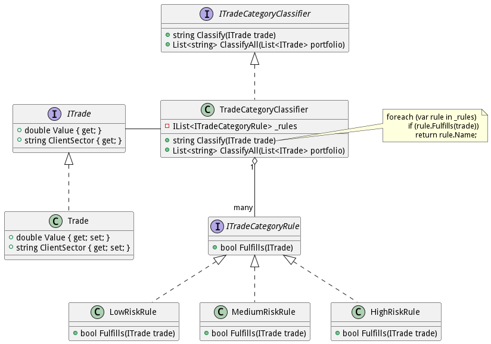

# CategorizedTrades

A C# Solution for Trades classification. There are two approaches:

1) Object Oriented Programming: The strategy pattern was used to model rules for each Trade Category.
   
- Considering that many Rules can take into place, it was defined an interface **ITradeCategoryRule**. Each new rule should implements this interface.
- A Category Classifier can also has its own manner to use Rule. Therefore, it was created an interface **ITradeCategoryClassifier** that contains the logic to classify a trade or a list of trades.
- Finally, the **TradeCategoryClassifier** implements **ITradeCategoryClassifier** and uses all rules trough a list of **ITradeCategoryRule**. The yellow balloon shows the implementation of *classify* method.

Considering this implementation, it is possible to create complex rules using SOLID principles:
- S: Single-Responsibility -> Every class should have only one reason to change
- O: Open-Closed -> We can extend Business Rules implementing different interfaces 
- L: Liskov Substitution -> We can exchange one implementation to another without affecting logical problems
- I: Interface Segregation -> All interfaces are isolated themselves and concerns to an unique context
- D: Dependency Inversion -> All rules can be Injected into TradeCategoryClassifier though its constructor

2) Database Model: There are 2 tables (ClientSectors and Trades). In order to Satisfy 3NF, the Risk Column cannot be used to store values (because it should not depend on non key columns). Therefore, the solution proposed is the function **dbo.ClassifyTradesFunction**, that receives a tradeId an computes the risk. The final output of all Trades can be viewed in **TradesComputed** view. 